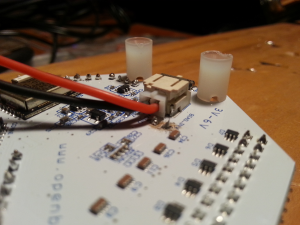
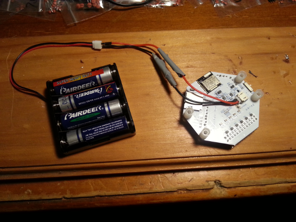

I've been playing around with the eight-channel
[OpenBCI](http://openbci.com/) 32-bit EEG board and I'm quite
pleased with it - it's flexible, hackable and even fairly portable. The
few[^gripe] minor gripes I had proved to be quite easy to work around.

The board needs a 6v DC power supply, provided by the included AA
battery pack. It works fine (one set of batteries will probably last
[quite a while](http://eeghacker.blogspot.com.au/2015/01/estimating-openbci-battery-life.html)), but I don't like having to worry
about draining it while I'm working[^warning]. The connector is also a little more
fiddly than I'd like and close to a lot of exposed ICs, so e.g.,
packing the board away following self-experimentation to determine the
effect of alcohol on brainwaves is made slightly more risky than it
already is (not that I would ever do such a thing of course).

To make matters worse, if you want to solder headers to the BIAS\_INV
pin you're going to need to be a lot more dextrous than me (even while
sober!) to connect or disconnect the power supply past the pin end. (I
discovered this the hard way, which is how that area of the board got
that warm charcoal tinge while I removed the offending header.)

I did want to use that pin, so I found a couple of the relevant power
connector[^power-connector], soldered a male and a female together to make an
extension lead, and put that in place before soldering the BIAS\_INV
header back on.

[^gripe]: For example, the Processing GUI doesn't have an option for a 50Hz notch filter rather than a 60Hz one (for Americans, 50Hz is the AC frequency most of the rest of the world uses). I'll submit a fix for this when I next have some time to play around with the board.

[^power-connector]: The 'correct' part isn't actually documented anywhere I can find, but as far as I can tell they're [JST MCP-X](http://www.micronwings.com/Products/JSTMCP-XConnectors/index.shtml) connectors.

[^warning]: OpenBCI recommends using the official power supply only; consider yourself warned.
